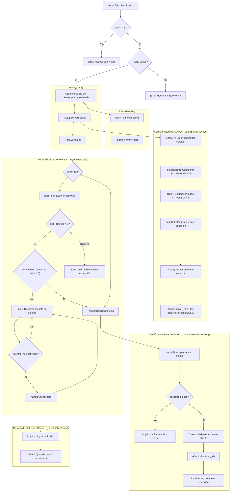

# ft_irc: Servidor de Internet Relay Chat en C++98

Este proyecto consiste en la creación de un servidor de IRC desde cero en C++98, adhiriéndose a las especificaciones de las RFCs y capaz de gestionar múltiples clientes de forma simultánea utilizando I/O no bloqueante.

---

## 1. Funciones Utilizadas

A continuación se listan todas las funciones externas utilizadas en el proyecto, organizadas por la librería de la que provienen.

### **`<sys/socket.h>`**
* `socket()`: Crea un punto final de comunicación (socket) y devuelve un file descriptor.
* `setsockopt()`: Permite configurar opciones en un socket. Lo usamos para `SO_REUSEADDR`.
* `bind()`: Asocia un socket a una dirección IP y un número de puerto.
* `listen()`: Pone un socket en modo pasivo, esperando a que los clientes se conecten.
* `accept()`: Extrae la primera conexión de la cola de pendientes y crea un nuevo socket para ella.

### **`<poll.h>`**
* `poll()`: Espera a que ocurra un evento en un conjunto de file descriptors, permitiendo la multiplexación de I/O.

### **`<fcntl.h>`**
* `fcntl()`: Realiza varias operaciones sobre un file descriptor. La usamos para establecer el modo no bloqueante (`O_NONBLOCK`).

### **`<unistd.h>`**
* `close()`: Cierra un file descriptor, liberando el recurso.

### **`<netinet/in.h>`**
* `htons()`: Convierte un número de 16 bits (como un puerto) del orden de bytes del host al orden de bytes de la red (network byte order).

### **`<iostream>`**
* `std::cout`: Objeto de flujo de salida estándar (generalmente la terminal).
* `std::cerr`: Objeto de flujo de salida de errores estándar.

### **`<string>`**
* `std::string`: Clase para la manipulación de secuencias de caracteres.

### **`<vector>`**
* `std::vector`: Contenedor dinámico que almacena elementos en secuencia.

### **`<cstdlib>`**
* `atoi()`: Convierte una cadena de caracteres a un entero.
* `EXIT_FAILURE`: Macro que representa un código de salida de error.

### **`<stdexcept>`**
* `std::runtime_error`: Clase de excepción estándar para reportar errores detectados en tiempo de ejecución.

---

## 2. Arquitectura de Clases

La arquitectura del servidor se centra en la clase `Server`, que encapsula toda la lógica de red.

### **`Server.hpp`**

#### Descripción
La clase `Server` es el corazón del programa. Es responsable de inicializar el socket de escucha, gestionar el ciclo de vida del servidor y manejar las conexiones de los clientes.

#### Atributos Privados
* `int _port`: Almacena el puerto en el que el servidor está escuchando.
* `std::string _password`: Almacena la contraseña requerida para que los clientes se conecten.
* `int _server_fd`: El file descriptor del socket principal de escucha del servidor.
* `std::vector<struct pollfd> _fds`: Un vector que contiene las estructuras `pollfd` para todos los sockets que se están vigilando (el del servidor y los de los clientes).

#### Métodos Públicos
* `Server(int port, std::string password)`: Constructor que inicializa el servidor con un puerto y una contraseña.
* `~Server()`: Destructor que se asegura de cerrar el socket del servidor para liberar los recursos.
* `void start()`: El método principal que orquesta el inicio del servidor.

#### Métodos Privados
* `void _setupServerSocket()`: Realiza toda la configuración inicial del socket del servidor: `socket`, `setsockopt`, `fcntl`, `bind` y `listen`.
* `void _runEventLoop()`: Contiene el bucle `while(true)` principal del servidor, donde se llama a `poll()` para esperar y gestionar eventos de red.
* `void _handleNewConnection()`: Se encarga de aceptar una nueva conexión de cliente entrante y añadirla al vector `_fds` para ser vigilada.
* `void _handleClientData(int client_idx)`: (Actualmente un placeholder) Será la función encargada de gestionar los datos recibidos de un cliente existente.

---

## 3. Flujo General del Programa

El programa sigue un flujo lógico desde el inicio hasta la gestión de eventos.

1.  **Inicio (`main.cpp`):**
    * El programa se ejecuta y la función `main` comprueba si se han proporcionado los argumentos correctos (`<port>` y `<password>`).
    * Valida que el puerto sea un número válido.
    * Crea una instancia de la clase `Server` dentro de un bloque `try...catch` para capturar cualquier error crítico durante la inicialización.
    * Llama al método `server.start()`.

2.  **Configuración del Servidor (`Server::_setupServerSocket()`):**
    * El método `start()` llama a esta función privada para preparar el entorno de red.
    * Se crea un socket TCP/IP (`socket`).
    * Se configura para reutilizar la dirección (`setsockopt`).
    * Se establece en modo no bloqueante (`fcntl`).
    * Se enlaza al puerto especificado y a todas las interfaces de red disponibles (`bind`).
    * Se pone en modo de escucha para aceptar conexiones entrantes (`listen`).
    * Finalmente, añade el file descriptor del socket de escucha a la lista de vigilancia (`_fds`).

3.  **Bucle de Eventos (`Server::_runEventLoop()`):**
    * Una vez configurado, el servidor entra en un bucle infinito.
    * La ejecución del programa se bloquea en la llamada a `poll()`, que espera eficientemente a que haya actividad en cualquiera de los sockets vigilados.
    * Cuando `poll()` devuelve un valor positivo (indicando actividad), el bucle continúa.
    * **Comprobación de Nuevas Conexiones:** Se comprueba si la actividad ha ocurrido en el socket del servidor. Si es así, se llama a `_handleNewConnection()`.
    * **Comprobación de Datos de Clientes:** Se recorre el resto de los sockets en la lista `_fds`. Si algún socket de cliente tiene actividad, se llama a `_handleClientData()`.

4.  **Gestión de Conexiones (`Server::_handleNewConnection()`):**
    * Se llama a `accept()` para aceptar al nuevo cliente.
    * Se crea una nueva estructura `pollfd` para el socket del cliente.
    * Esta nueva estructura se añade al final del vector `_fds`, integrando al nuevo cliente en el bucle de eventos para futuras comprobaciones.

### Diagrama de flujo

